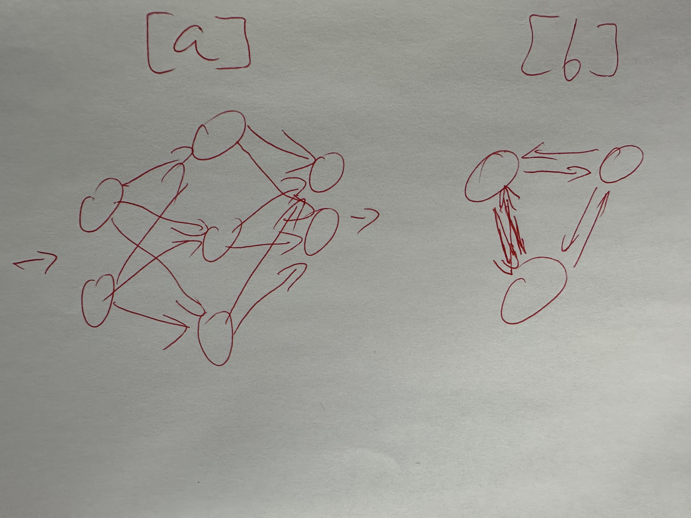
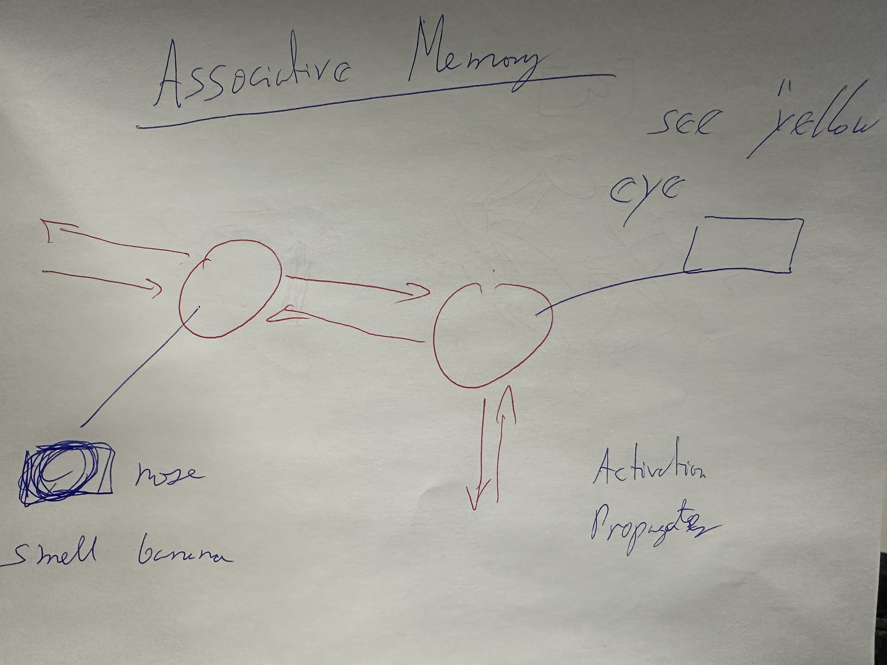
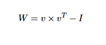

## Model Cyber Cases 

* https://github.com/rcalix1/DeepLearningAlgorithms/tree/main/SecondEdition/Chapter2_TraditionalML
* 

## Hopfield Networks

* Code Example: https://github.com/rcalix1/CyberSecurityAndMachineLearning/blob/main/FirstEdition/Ch3_TraditionalML/HopfieldNetworks.ipynb
* 

## Hopfield Networks

* We discussed the perceptron. Now it is time to connect multiple neurons together
* we now make the output of one neuron into the input to another neuron
* and this allows us to create neural networks
* Neural Nets can be of 2 types:
* a) Feedforward Nets (all in one direction - directed acyclic graph)
* b) Feedback nets (if not feedforward, then a network is a feed back net)
* This classification depends on their connectivity
* 

* they have been used to study associative memory. Memory can be used for anomaly detection, for instance

## Hebbian Training

* Hopfield Networks  are sometimes called associative memory networks.
* John Hopfield won the 2024 nobel prize in physics for this work.
* They can be related to Information Theory because they can be used to store and re-construct (retrieve) information.
* The number of neurons can determine the amount of information that can be stored in the model.
* Hopfield Networks use the "outer product" multiplication to calculate the weights matrix.
* The "outer product" is an operation in linear algebra which, given 2 vectors, can return a matrix.
* The "outer product" operation can be seen in the next example:

 

* The weights are calculated via an "outer product" of the input vector and the transpose of the same vector.
* The identity matrix is subtracted from the resulting matrix as can be seen in the following formulation.

 

* Here are some important points to note about Hopfield networks and the code:
* np.outer produces one product between each possible element pairing from 2 tensors
* np.outer is used for the "outer product" 
* The intuition is like a pairwise distance matrix
* This can help us to find the distance between each pair of point values

## Disclaimer

* AI assisted content. This post includes Amazon affiliate links 

